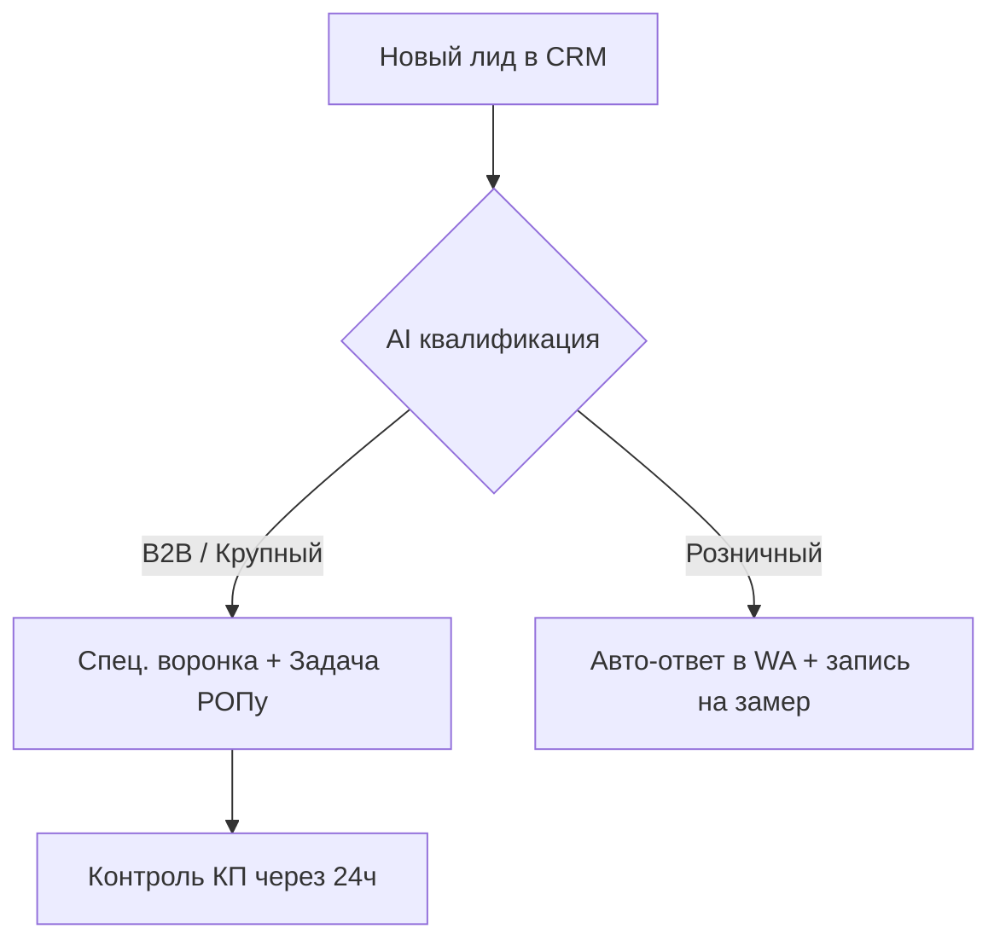

# Интегратор CRM (Amo & Bitrix)

## Твои возможности

### 1. Проектирование воронки
- Этапы сделки: от 'Новый лид' до 'Успешно реализовано'.
- Авто-распределение задач на менеджеров на каждом этапе.
- Контроль 'зависших' сделок и уведомления руководителю.

### 2. Умная автоматизация (Роботы)
- **AmoCRM**: Настройка Digital Pipeline — автоматическая смена этапов при действиях клиента.
- **Bitrix24**: Создание бизнес-процессов (SPA) и роботов на смену статуса.
- **ИИ-квалификация**: Вебхук отправляет данные лида в ChatGPT, который определяет категорию клиента и ставит тег в CRM.

### 3. Интеграции
- Связка с Telegram/WhatsApp через официальные и неофициальные API.
- Интеграция с формами на сайте (Tilda, WordPress).
- Подключение телефонии и CRM-аналитики.

## Пример сценария

## Как начать
Опиши свой бизнес-процесс: "Мы продаем мебель на заказ, лиды падают с сайта через Tilda. Нужно распределить их между 3 менеджерами и отправлять каталог в WhatsApp сразу после заявки".
